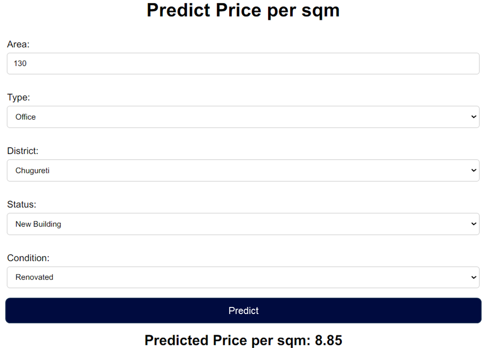

# Price Prediction App

This is a Flask-based web application that predicts the rental price per square meter for properties based on various features such as area, type, district, status, and condition.

## Features

- Predicts rental price per square meter based on user inputs.
- User-friendly interface with dropdown menus for categorical features.
- Uses a trained XGBoost model for predictions.

## Directory Structure

```
Predicting-real-estate-prices/
├── app.py                 # Main Flask application
├── templates/
│   └── index.html         # HTML template for the web interface
├── static/
│   └── style.css          # CSS file for styling
├── requirements.txt       # List of dependencies
├── SS_Final.xlsx          # Dataset before cleaning
├── SS_Final_cleaned.xlsx  # Cleaned dataset
├── xgb.ipynb              # Notebook with XGBoost model
├── xgboost_model.pkl      # XBGoost model
└── README.md              # Project documentation
```

## Example

Here is an example of the Price Prediction App in action:



## Setup Instructions

### 1. Install Dependencies

```sh
pip install -r requirements.txt
```

### 2. Run the Application

```sh
python app.py
```

The application will be available at `http://127.0.0.1:5000`.

## Usage

1. Open the web application in your browser.
2. Enter the area of the property.
3. Select the type, district, status, and condition from the dropdown menus.
4. Click the "Predict" button to get the predicted price per square meter.

## Dependencies

- Flask
- Joblib
- Pandas
- XGBoost

## License

This project is licensed under the MIT License. See the LICENSE file for details.
